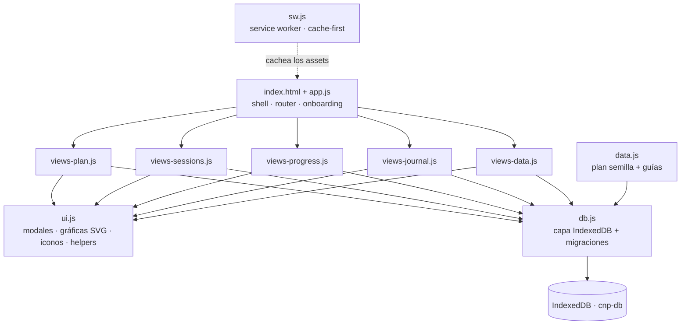
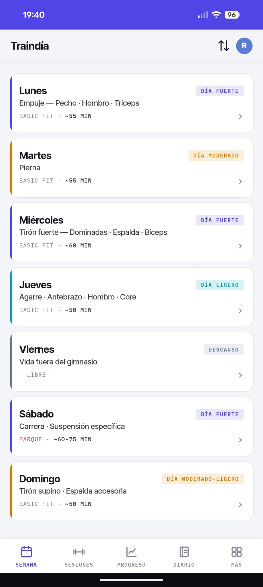
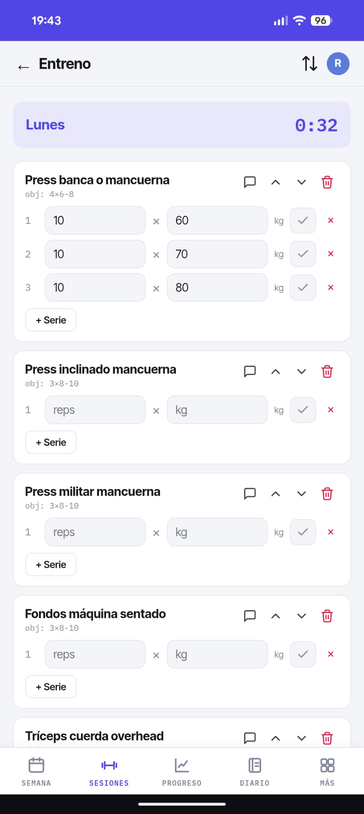
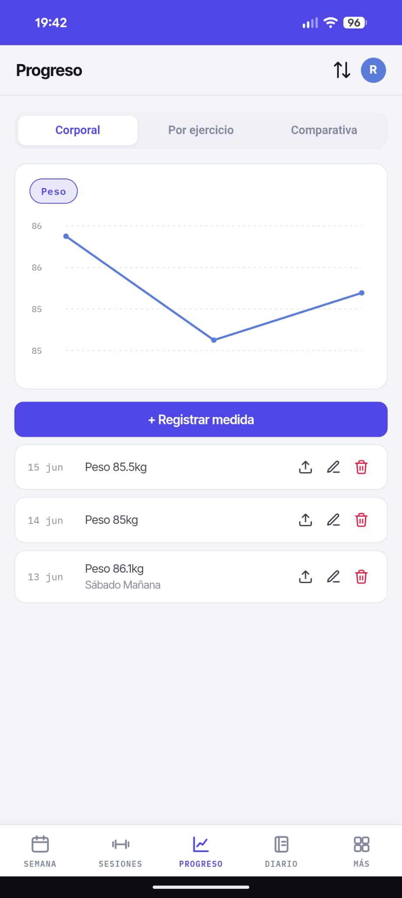
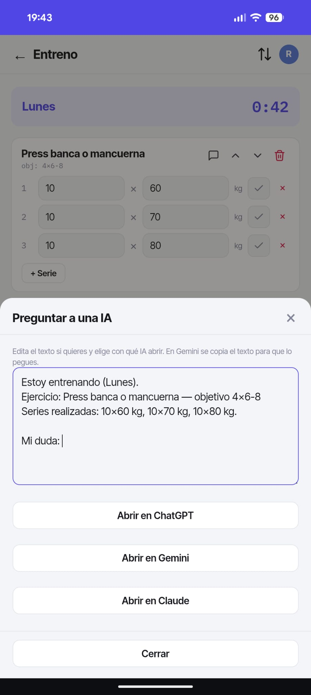

<div align="center">


# Traindía

### Tu entrenamiento, de principio a fin — en una PWA instalable que funciona 100 % offline

Planifica tu rutina, registra cada sesión, sigue tu progreso y lleva tu diario.
Sin cuentas, sin servidores, sin dependencias. Tus datos viven en tu dispositivo.

<br>

[](https://raulmarquez24.github.io/Traindia/)


</div>

---

## 📖 Qué es

**Traindía** es una aplicación web progresiva (PWA) para gestionar tu entrenamiento por completo, pensada para usarse en el gimnasio (incluso sin cobertura). Organizas uno o varios **planes** semanales, registras tus **sesiones** (en vivo con cronómetro o a mano), analizas tu **progreso** con gráficas y llevas un **diario**. Todo queda guardado **en local**, sin registro ni backend, y puedes **exportar/importar** para compartir o hacer copias.

Nació como un plan de entrenamiento concreto y evolucionó a una herramienta genérica y reutilizable para cualquier rutina.

## ✨ Funcionalidades

#### 🗓️ Planes y rutina
- **Varios planes** por perfil, con uno activo; **crea, cambia y elimina** planes.
- Al empezar eliges plantilla: **plan CNP** (completo, con guías) o **plan personalizado** (en blanco).
- Semana de días editables: **bloques/categorías, ejercicios, orden, series objetivo**, marcando prioritarios y opcionales.
- **Intercambiar días**, **lugares de entreno** (con lugares “especiales” destacados) y **restaurar** un día o el plan original.
- **Suplentes** por ejercicio (“el sustituto de X es Y o Z”) y **Plan B** por día (alternativas según la situación: “si llueve…”).

#### 🏋️ Sesiones
- Registro **en vivo** con cronómetro y marcado de series, o **manual** indicando la duración.
- Campos según el tipo de ejercicio: **peso + reps**, **reps** (peso corporal) o **tiempo**.
- Soporte de **cardio**: velocidad (km/h), inclinación (%) y nivel.
- **🤖 Pregunta a una IA:** genera un resumen del ejercicio/serie y lo abre en **ChatGPT, Gemini o Claude** para resolver dudas al instante.
- **Volumen** (reps × kg) y **duración** calculados solos; reordena ejercicios y añade **notas**.
- Historial **agrupado por día** con **filtros por año / mes / día** y por autor.

#### 📈 Progreso
- **Peso corporal y medidas** por fecha.
- **Historial por ejercicio**: peso máximo, volumen y reps a lo largo del tiempo.
- **Comparativa** entre el perfil principal y un invitado.
- Gráficas **SVG** hechas a mano (sin librerías).

#### 👥 Perfiles
- Un **perfil principal** (dueño del dispositivo, siempre activo) y **perfiles invitados** de referencia.
- Los invitados sirven para **importar datos a su nombre** y **comparar** progreso.
- Color de perfil con **colores principales + paleta completa**.

#### 🏷️ Catálogo de ejercicios
- Agrupado por **grupo muscular** y vinculado a los días: lo que quitas de la rutina pasa a **“en desuso”**.
- Editar un ejercicio **propaga el cambio** (nombre/tipo) a toda la app.
- Los ejercicios **predefinidos no se borran** (siempre disponibles).

#### 📓 Diario
- Entradas con **texto y estado de ánimo** (5 emojis), vinculadas a tu perfil.

#### 📚 Guías
- Documentación incluida en el plan CNP (técnica, progresiones, lógica de la semana…), **enlazada desde cada día**.

#### ↕️ Importar / Exportar
- Granular: **perfil completo, un día, sesiones (rango o concretas), rutinas, progreso** → JSON.
- Al importar eliges **a qué perfil** se asigna, **qué secciones** traer y cómo resolver conflictos (**reemplazar** o **añadir lo que falte**, con re-mapeo de referencias).

#### 📲 PWA
- Instalable en pantalla de inicio, **100 % offline** tras la primera carga, icono y tema propios.

## 🧩 Arquitectura

**Vanilla JS · sin frameworks · sin build · 0 dependencias.** Solo HTML, CSS y JS servidos como estáticos.



### Modelo de datos (IndexedDB · `cnp-db`)

Todos los registros (salvo `settings`) llevan `userId`, generado en el primer arranque y persistente.

| Store | Contenido |
|-------|-----------|
| `settings` | Configuración: usuario principal, lugares, versión de datos |
| `users` | Perfiles (principal e invitados): nombre, color |
| `exercises` | Catálogo: nombre, grupo muscular, tipo, suplentes |
| `routines` | Planes: días → bloques → ejercicios |
| `sessions` | Entrenos registrados: ejercicios, series, duración, notas |
| `progress` | Peso corporal y medidas por fecha |
| `journal` | Entradas de diario: texto y estado de ánimo |

### Estructura del proyecto

```
traindia/
├── index.html              · shell, tema (variables CSS), service worker
├── styles.css              · estilos de componentes
├── app.js                  · estado, router, onboarding, perfiles, ajustes
├── db.js                   · IndexedDB, semilla y migraciones
├── ui.js                   · modales, toasts, formularios, selector de color, gráficas SVG
├── data.js                 · plan semilla + guías
├── views-plan.js           · planes, días, lugares, catálogo, guías
├── views-sessions.js       · registro en vivo / manual, historial
├── views-progress.js       · progreso corporal, por ejercicio, comparativa
├── views-journal.js        · diario
├── views-data.js           · importar / exportar
├── manifest.json           · metadatos PWA
├── sw.js                   · service worker (offline)
└── icon*.png · icon.svg    · iconos (app, maskable, favicon)
```

## 🚀 Desarrollo local

Los Service Workers necesitan un servidor (abrir `index.html` con doble clic no basta):

```bash
python3 -m http.server 8000   # o:  npx serve
```

Abre `http://localhost:8000`.

## ☁️ Despliegue

Publicado con **GitHub Pages** desde `main` (`/root`). Cada push redespliega solo.

> [!IMPORTANT]
> **Actualizaciones:** el service worker es *cache-first*. Para que los cambios lleguen a las apps ya instaladas, sube `CACHE_NAME` en `sw.js` (p. ej. `traindia-v2.5.0` → `v2.5.1`). Al activarse, borra la caché de archivos antigua y descarga la nueva.

> [!NOTE]
> **Tus datos no se tocan al actualizar.** Los archivos viven en *Cache Storage* y los datos en *IndexedDB*: son almacenes distintos. Subir `CACHE_NAME` solo renueva los archivos; el perfil, sesiones y progreso permanecen.

## 📲 Instalar en el móvil

- **Android (Chrome):** abre la URL → menú ⋮ → *Añadir a pantalla de inicio*.
- **iPhone (Safari):** abre la URL en Safari → botón compartir → *Añadir a pantalla de inicio*.

## 🔒 Privacidad y offline

- **100 % local:** sin cuentas, login ni servidor. Tus datos no salen del dispositivo.
- **Offline-first:** tras la primera carga, funciona sin conexión.
- **Tú mandas:** exporta/importa en JSON; “Borrar todos los datos” lo deja a cero.

## 📸 Capturas

<div align="center">

| Semana | Registro en vivo |
|:---:|:---:|
|  |  |
| **Progreso** | **Pregunta a una IA** |
|  |  |

</div>

## 📄 Derechos

**© 2026 Raúl Márquez. Todos los derechos reservados.**

Este repositorio es **público con fines de demostración y portafolio**. Puedes
ver el código y la app, pero **no está permitido copiarlo, reutilizarlo,
redistribuirlo ni publicarlo** (total o parcialmente) sin permiso expreso del autor.
Al no incluir una licencia de código abierto, se aplican los derechos de autor por
defecto (*all rights reserved*).

---

<div align="center">
<sub>Hecho con vanilla JS · PWA offline-first · sin dependencias · ♥</sub><br>
<sub>© 2026 Raúl Márquez · Todos los derechos reservados</sub>
</div>
