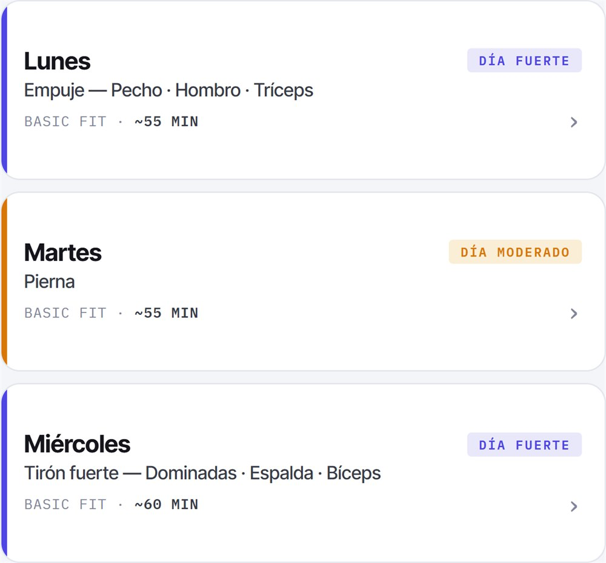
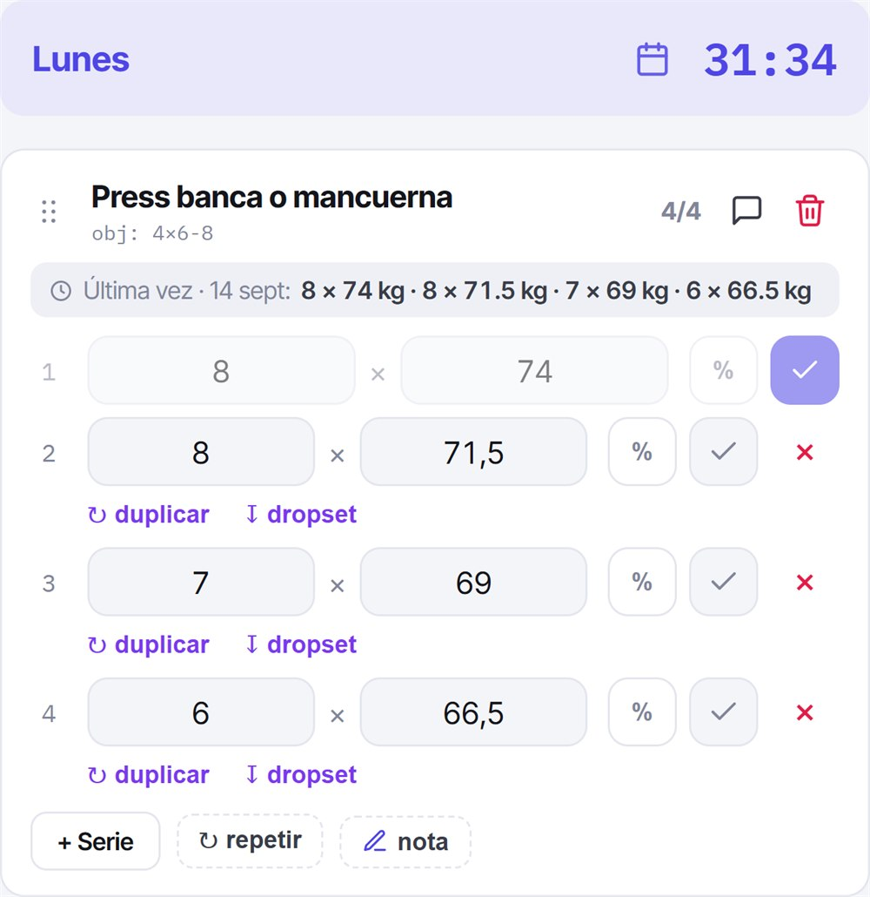
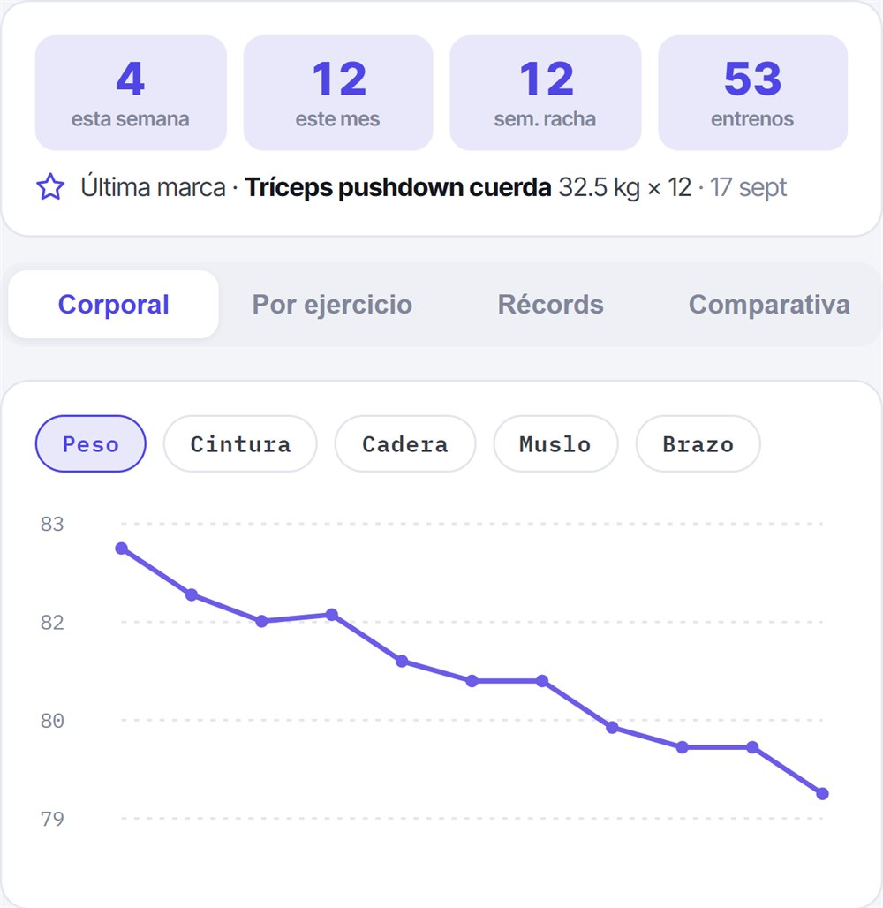
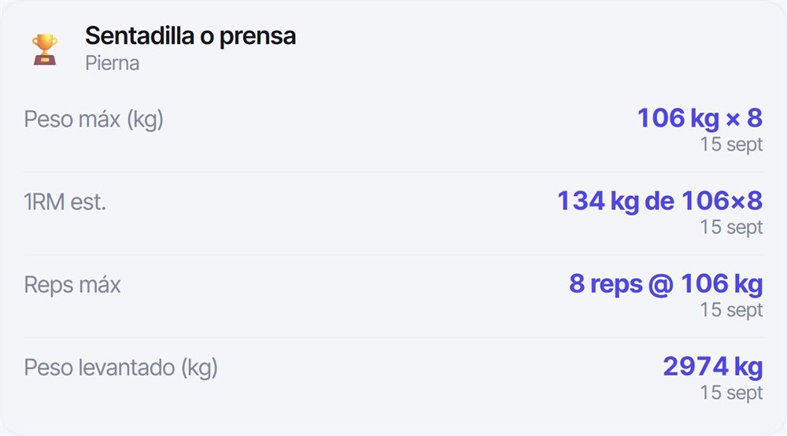
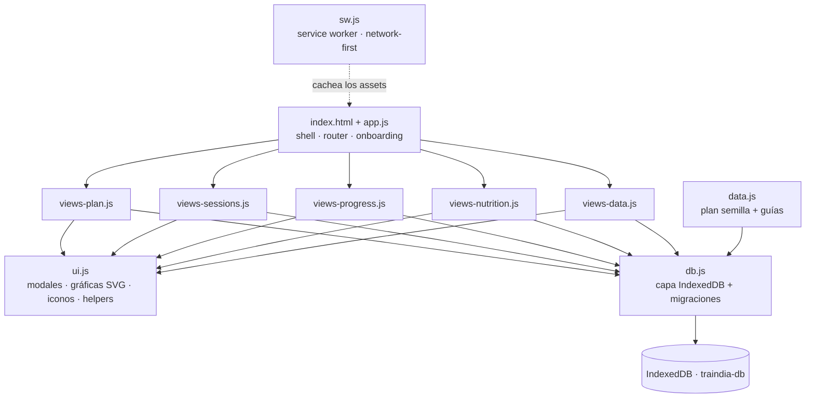

<div align="center">


# Traindía

### Tu entrenamiento, de principio a fin — en una PWA instalable que funciona 100 % offline

Planifica tu rutina, registra cada sesión, sigue tu progreso y consulta qué te toca comer hoy.
Sin cuentas, sin servidores, sin dependencias. Tus datos viven en tu dispositivo.

<br>

[](https://traindia.raulmarquez.dev/)

**[traindia.raulmarquez.dev](https://traindia.raulmarquez.dev/)**


</div>

---

## 📸 Así se ve

<div align="center">

<table>
<tr>
<td width="50%" align="center">
<picture>
  <source media="(prefers-color-scheme: dark)" srcset="ui-semana-dark.jpg">
  
</picture>
<br><sub><b>Tu semana, de un vistazo</b></sub>
</td>
<td width="50%" align="center">
<picture>
  <source media="(prefers-color-scheme: dark)" srcset="ui-entreno-dark.jpg">
  
</picture>
<br><sub><b>Apuntar sin cortar el ritmo</b></sub>
</td>
</tr>
<tr>
<td width="50%" align="center">
<picture>
  <source media="(prefers-color-scheme: dark)" srcset="ui-progreso-dark.jpg">
  
</picture>
<br><sub><b>La gráfica no discute</b></sub>
</td>
<td width="50%" align="center">
<picture>
  <source media="(prefers-color-scheme: dark)" srcset="ui-records-dark.jpg">
  
</picture>
<br><sub><b>Cada récord, con su fecha</b></sub>
</td>
</tr>
</table>

<sub>Las capturas se adaptan al tema claro u oscuro de tu GitHub.</sub>

</div>

---

## 📖 Qué es

**Traindía** es una aplicación web progresiva (PWA) para gestionar tu entrenamiento por completo, pensada para usarse en el gimnasio (incluso sin cobertura). Organizas uno o varios **planes** semanales, registras tus **sesiones** (en vivo con cronómetro o a mano), analizas tu **progreso** con gráficas y consultas tu **plan de alimentación**. Todo queda guardado **en local**, sin registro ni backend, y puedes **exportar/importar** para compartir o hacer copias.

Nació como un plan de entrenamiento concreto y evolucionó a una herramienta genérica y reutilizable para cualquier rutina.

## ✨ Funcionalidades

#### 🗓️ Planes y rutina
- **Varios planes** por perfil, con uno activo; **crea, cambia y elimina** planes.
- Al empezar tienes tu **plan personalizado** (7 días en blanco que montas a tu medida); más plantillas en camino.
- Semana de días editables: **bloques/categorías, ejercicios, orden, series objetivo**, marcando prioritarios y opcionales.
- **Intercambiar días**, **lugares de entreno** (con lugares “especiales” destacados) y **restaurar** un día o el plan original.
- **Suplentes** por ejercicio (“el sustituto de X es Y o Z”) y **Plan B** por día (alternativas según la situación: “si llueve…”).

#### 🏋️ Sesiones
- Registro **en vivo** con cronómetro y marcado de series, o **manual** indicando la duración.
- Campos según el tipo de ejercicio: **peso + reps**, **reps** (peso corporal) o **tiempo**.
- Soporte de **cardio**: velocidad (km/h), inclinación (%) y nivel.
- **🤖 Pregunta a una IA:** genera un resumen del ejercicio/serie y lo abre en **ChatGPT, Gemini o Claude** para resolver dudas al instante.
- **Volumen** (reps × kg) y **duración** calculados solos; reordena ejercicios y añade **notas**.
- Historial **agrupado por día** con **filtros por año / mes / día** y por autor.

#### 📈 Progreso
- **Peso corporal y medidas** por fecha.
- **Historial por ejercicio**: peso máximo, volumen y reps a lo largo del tiempo.
- **Comparativa** entre el perfil principal y un invitado.
- Gráficas **SVG** hechas a mano (sin librerías).

#### 👥 Perfiles
- Un **perfil principal** (dueño del dispositivo, siempre activo) y **perfiles invitados** de referencia.
- Los invitados sirven para **importar datos a su nombre** y **comparar** progreso.
- Color de perfil con **colores principales + paleta completa**.

#### 🏷️ Catálogo de ejercicios
- Agrupado por **grupo muscular** y vinculado a los días: lo que quitas de la rutina pasa a **“en desuso”**.
- Editar un ejercicio **propaga el cambio** (nombre/tipo) a toda la app.
- Los ejercicios **predefinidos no se borran** (siempre disponibles).

#### 🍎 Nutrición
- **Lo que te toca hoy**: la app mira tu plan de entreno y enseña el gramaje del día que sea (**entrenamiento** o **descanso**).
- Cada comida tiene sus **opciones** —lo que te marcó tu nutricionista— y dentro, los alimentos por **tipo**: *hidrato 75 g: arroz **o** pasta **o** cuscús*. Los intercambiables se ven como iguales, con su cantidad y su equivalencia en cocido.
- Una opción declara **para qué días vale**, así que las tortitas del día de entreno no aparecen en descanso.
- **Tus platos**: guardas lo que cocinas con esas cantidades (*«Risotto»*, *«Puchero»*), con foto, preparación, ingredientes extra y la posibilidad de ajustar los gramos a tu manera.
- **🤖 Importar con IA** *(beta)*: la app genera un texto largo que le llevas a ChatGPT, Gemini o Claude junto al PDF de tu dieta; te devuelve un archivo que Traindía valida y previsualiza antes de guardar. Las **dudas** que anota la IA se marcan como aclaradas una a una.
- **Reglas, suplementación y documentos** del plan a mano en la misma pantalla.

#### 📎 Documentos
- Guarda el **PDF del fisio o del nutricionista**, fotos de una máquina o cualquier apunte, y consúltalos **durante el entreno** o desde el plan de nutrición, sin conexión.
- En el móvil llegan también con **Compartir → Traindía** (útil para los adjuntos de WhatsApp, imposibles de encontrar en el explorador).

#### 📚 Guías
- Documentación incluida en los planes completos (técnica, progresiones, lógica de la semana…), **enlazada desde cada día**.

#### ↕️ Importar / Exportar
- Granular: **perfil completo, un día, sesiones (rango o concretas), rutinas, progreso, plan de nutrición** → JSON.
- Al importar eliges **a qué perfil** se asigna, **qué secciones** traer y cómo resolver conflictos (**reemplazar** o **añadir lo que falte**, con re-mapeo de referencias).
- Los **documentos no viajan** en el JSON: viven solo en el dispositivo.

#### 📲 PWA
- Instalable en pantalla de inicio, **100 % offline** tras la primera carga, icono y tema propios.
- **Tema** claro, oscuro o el del sistema, con la barra del navegador a juego.

#### 👋 Presentación
- Quien llega **sin perfil** ve una página de presentación (la misma `index.html`); quien ya lo tiene entra directo a la app.
- Los pasos se recorren en **horizontal** mientras bajas, con la sección anclada. Sin JavaScript o con *reducir movimiento* del sistema se leen en vertical, uno debajo de otro — que es lo que indexan Google y los asistentes.
- Datos estructurados `WebApplication` y `FAQPage`, Open Graph y Twitter Card.

## 🧩 Arquitectura

**Vanilla JS · sin frameworks · sin build · 0 dependencias.** Solo HTML, CSS y JS servidos como estáticos.



### Modelo de datos (IndexedDB · `traindia-db`)

Todos los registros (salvo `settings`) llevan `userId`, generado en el primer arranque y persistente.

| Store | Contenido |
|-------|-----------|
| `settings` | Configuración: usuario principal, lugares, versión de datos |
| `users` | Perfiles (principal e invitados): nombre, color |
| `exercises` | Catálogo: nombre, grupo muscular, tipo, suplentes |
| `routines` | Planes: días → bloques → ejercicios |
| `sessions` | Entrenos registrados: ejercicios, series, duración, notas |
| `progress` | Peso corporal y medidas por fecha |
| `nutrition` | Planes de alimentación: variantes de día → comidas → opciones → alimentos, y tus platos |
| `files` | Documentos guardados en el dispositivo (PDF, fotos): nombre, tipo y contenido |

### Estructura del proyecto

```
traindia/
├── index.html              · shell, presentación, tema (variables CSS), SEO
├── styles.css              · estilos de componentes
├── app.js                  · estado, router, onboarding, perfiles, ajustes, presentación
├── db.js                   · IndexedDB, semilla y migraciones
├── ui.js                   · modales, toasts, formularios, selector de color, gráficas SVG
├── data.js                 · plan semilla + guías
├── views-plan.js           · planes, días, lugares, catálogo, guías
├── views-sessions.js       · registro en vivo / manual, historial
├── views-progress.js       · progreso corporal, por ejercicio, récords, comparativa
├── views-nutrition.js      · nutrición: pauta del día, platos, importador por IA
├── views-data.js           · importar / exportar
├── manifest.json           · metadatos PWA
├── sw.js                   · service worker (offline)
├── ui-*-light/dark.jpg     · capturas de la presentación (y de este README)
├── og-image.jpg            · imagen al compartir (1200×630, <300 KB o WhatsApp no la agranda)
├── robots.txt · sitemap.xml · google*.html   · SEO y verificación
└── icon*.png · icon.svg · favicon*           · iconos (app, maskable, favicon)
```

## 🚀 Desarrollo local

Los Service Workers necesitan un servidor (abrir `index.html` con doble clic no basta):

```bash
python3 -m http.server 8000   # o:  npx serve
```

Abre `http://localhost:8000`.

## ☁️ Despliegue

Publicado con **GitHub Pages** desde `main` (`/root`). Cada push redespliega solo.

> [!IMPORTANT]
> **Actualizaciones:** el service worker es *network-first* para los archivos propios (con `{cache:'reload'}`, para saltarse también la caché HTTP de Pages), así que con conexión siempre sirve lo último y los cambios se ven al recargar. Aun así, **sube `CACHE_NAME` en `sw.js` en cada despliegue** (`traindia-build-N`): es lo que descarta la copia offline antigua. Las fuentes externas sí van *cache-first*.

> [!WARNING]
> GitHub Pages **no siempre reacciona al push**: a veces tarda o directamente se salta el despliegue. Si tras unos minutos `sw.js` en producción sigue mostrando el `CACHE_NAME` anterior, un commit vacío en `main` lo desatasca.

> [!NOTE]
> **Tus datos no se tocan al actualizar.** Los archivos viven en *Cache Storage* y los datos en *IndexedDB*: son almacenes distintos. Subir `CACHE_NAME` solo renueva los archivos; el perfil, sesiones y progreso permanecen.

## 📲 Instalar en el móvil

- **Android (Chrome):** abre la URL → menú ⋮ → *Añadir a pantalla de inicio*.
- **iPhone (Safari):** abre la URL en Safari → botón compartir → *Añadir a pantalla de inicio*.

## 🔒 Privacidad y offline

- **100 % local:** sin cuentas, login ni servidor. Tus datos no salen del dispositivo.
- **Offline-first:** tras la primera carga, funciona sin conexión.
- **Tú mandas:** exporta/importa en JSON; “Borrar todos los datos” lo deja a cero.

## 📄 Derechos

**© 2026 Raúl Márquez. Todos los derechos reservados.**

Este repositorio es **público con fines de demostración y portafolio**. Puedes
ver el código y la app, pero **no está permitido copiarlo, reutilizarlo,
redistribuirlo ni publicarlo** (total o parcialmente) sin permiso expreso del autor.
Al no incluir una licencia de código abierto, se aplican los derechos de autor por
defecto (*all rights reserved*).

---

<div align="center">
<sub>Hecho con vanilla JS · PWA offline-first · sin dependencias · ♥</sub><br>
<sub>© 2026 Raúl Márquez · Todos los derechos reservados</sub>
</div>
